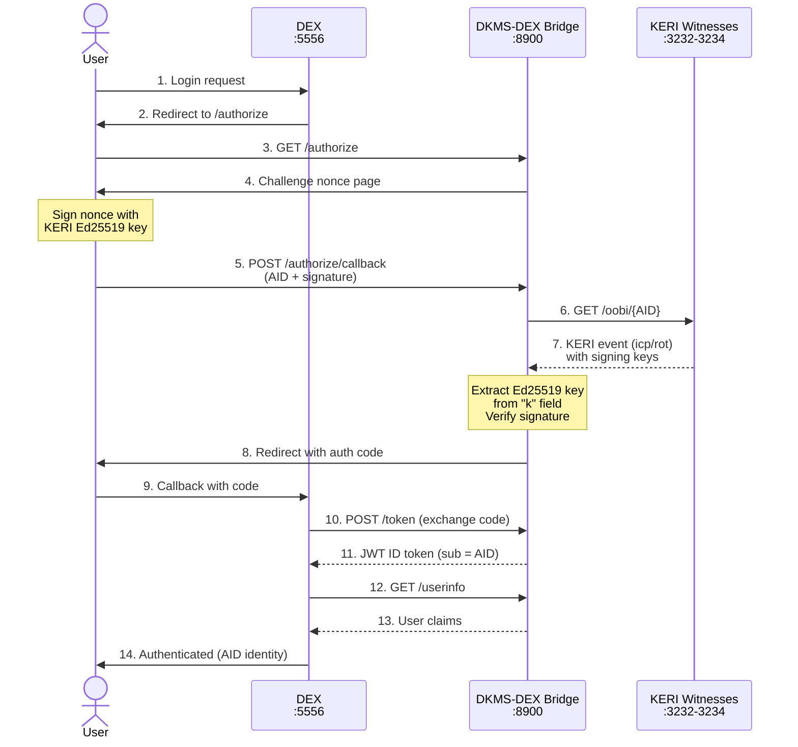
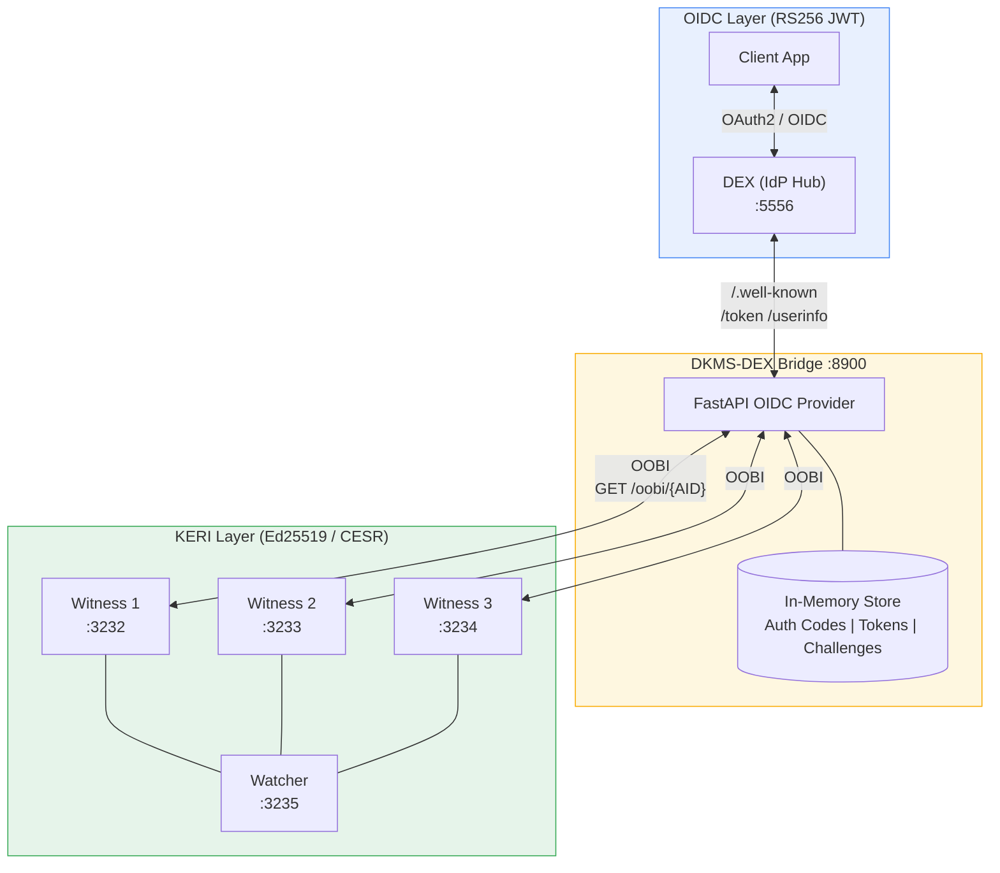

# DEX-DKMS Bridge

A minimal OIDC Provider that bridges [THCLab's KERI-based DKMS](https://github.com/THCLab/dkms-demo) to [DEX](https://dexidp.io/). DEX connects to this bridge via its built-in OIDC connector.

## Architecture

### Auth Flow



### Component Overview



## How It Works

1. DEX redirects user to the bridge's `/authorize` endpoint
2. Bridge presents a challenge nonce for KERI-based authentication
3. User provides their AID (Autonomic Identifier) and signs the nonce with their current KERI signing key (Ed25519)
4. Bridge resolves the AID via OOBI on configured KERI witnesses, extracts the signing key from the KEL, and verifies the signature
5. DEX exchanges the authorization code for a JWT ID token with AID-based claims

## Prerequisites

- Running [DKMS infrastructure](https://github.com/THCLab/dkms-demo) (witnesses, watcher, mesagkesto)
- A KERI AID created via `dkms-bin` or another KERI agent

## Quick Start

```bash
# Start DKMS infrastructure
cd /path/to/dkms-demo && docker-compose up -d

# Start the bridge
python3 -m venv .venv
source .venv/bin/activate
pip install -r requirements.txt
python bridge.py
```

The bridge starts at `http://localhost:8900`. Configure witness URLs in `config.yaml`.

## DEX Configuration

See `dex-config.yaml` for a sample DEX configuration that wires the OIDC connector to this bridge.

## OIDC Claims Mapping

| OIDC Claim | Value |
|---|---|
| `sub` | KERI AID prefix |
| `name` | KERI AID prefix |
| `preferred_username` | KERI AID prefix |
| `email` | `{aid_short}@dkms.bridge` (synthesized) |
